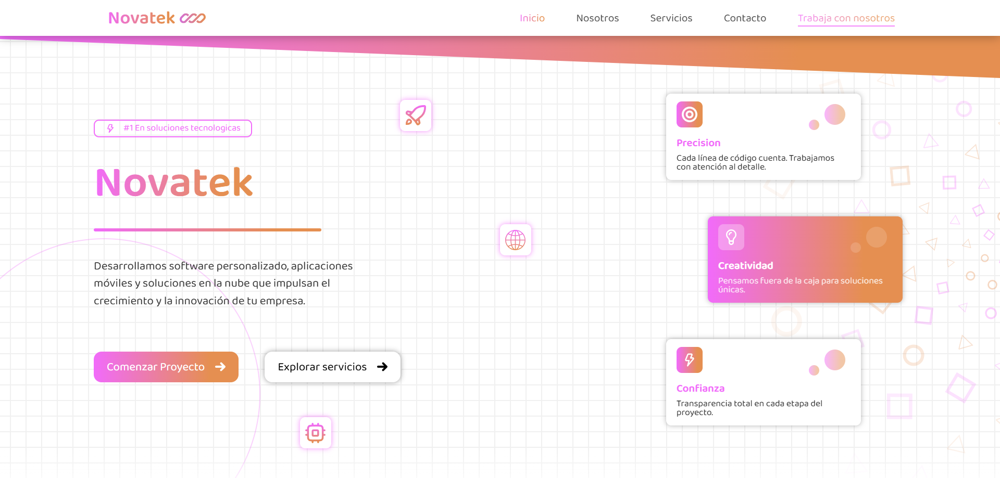

# Novatek

## Este proyecto es una Web SPA

- Simula una página web corporativa para una empresa ficticia llamada **Novatek**.
- Implementada como una Single Page Application (SPA) usando **Angular**.
- Incluye rutas a diferentes secciones como: **Inicio**, **Nosotros**, **Servicios**, entre otras.
- Contiene formularios con validación.

## Páginas principales del sitio

- **Inicio**: Presentación general de la empresa.
- **Nosotros**: Misión, visión y equipo.
- **Servicios**: Soluciones tecnológicas que ofrece la empresa.
- **Contacto**: Formulario o datos de contacto ficticios.
- **Trabaja con nosotros**: Posiciones laborales disponibles.

## Tecnologías Utilizadas

- Angular
- TypeScript, HTML y CSS

Puedes ver la demostración con **[Netlify](https://novatek-web.netlify.app/)**.

    

